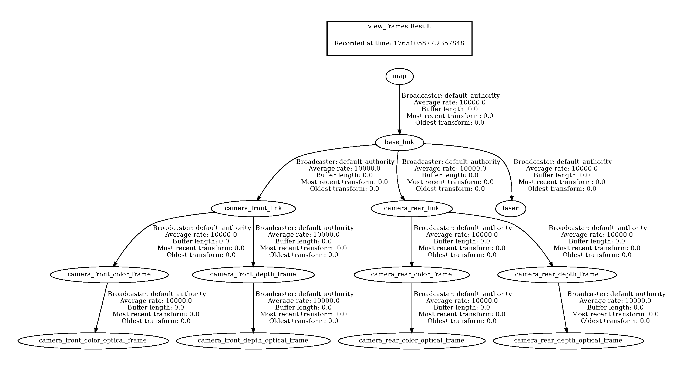

# camina_ros2
[](https://docs.ros.org/en/humble/)
[](https://docs.ros.org/en/jazzy/)

## 🚀 Overview
- Whole-body pose estimation

## 🛠️ Setup
### Camera setup
[ros2_astra_camera](https://github.com/iHaruruki/ros2_astra_camera.git)

### LiDAR setup
[urg_node2_setup](https://github.com/Hokuyo-aut/urg_node2.git)

### Install `UV`
```bash
curl -LsSf https://astral.sh/uv/install.sh | sh
echo 'eval "$(uv generate-shell-completion bash)"' >> ~/.bashrc
echo 'eval "$(uvx --generate-shell-completion bash)"' >> ~/.bashrc
```
> [!TIP]
> - uvは，超高速なPythonパッケージマネージャ  
> - 仮想環境の作成・パッケージ管理・Pythonバージョン管理を一元化  
> [Installing uv](https://docs.astral.sh/uv/getting-started/installation/)

### Dependent packages
```bash
# NUC34 & 35
sudo apt install ros-$ROS_DISTRO-urdf-tutorial ros-$ROS_DISTRO-rqt-tf-tree ros-$ROS_DISTRO-xacro ros-$ROS_DISTRO-joint-state-publisher ros-$ROS_DISTRO-joint-state-publisher-gui ros-$ROS_DISTRO-ffmpeg-image-transport ros-$ROS_DISTRO-ffmpeg-image-transport-tools ros-$ROS_DISTRO-image-transport ros-$ROS_DISTRO-image-transport-plugins ros-$ROS_DISTRO-compressed-image-transport
```

### Clone this package
```bash
# NUC34 & 35
cd ~/ros2_ws/src
git clone https://github.com/iHaruruki/camina_ros2.git
```

### Install python packages
```bash
cd ~/ros2_ws/src/camina_ros2/camina_ros2
uv sync
```

### Build
```bash
# NUC34 & 35
cd ~/ros2_ws
sudo chmod +x ~/ros2_ws/src/camina_ros2/camina_ros2/scripts/*.py

colcon build --symlink-install --packages-select camina_ros2_msgs
source install/setup.bash

colcon build --symlink-install --packages-select camina_ros2
source install/setup.bash
```

## 🎮 How to use
### Checking inter-device communication connections / デバイス間通信の接続確認
Run publisher
```bash
# NUC 35
ros2 run demo_nodes_cpp talker
```

Run subscriber
```bash
# NUC 34
ros2 run demo_nodes_cpp listener
```
Result / 実行結果
```bash
$ ros2 run demo_nodes_cpp listener
[INFO] [1765264820.324285384] [listener]: I heard: [Hello World: 1]
[INFO] [1765264821.324176160] [listener]: I heard: [Hello World: 2]
[INFO] [1765264822.324076114] [listener]: I heard: [Hello World: 3]
[INFO] [1765264823.324220092] [listener]: I heard: [Hello World: 4]
[INFO] [1765264824.324185182] [listener]: I heard: [Hello World: 5]
```
> [!NOTE]
> The `ROS_DOMAIN_ID` is an environment variable in ROS 2 that is used to separate multiple ROS 2 processes running on the same network.  
> `ROS_DOMAIN_ID` は，同じネットワーク上で実行されている複数の ROS 2 プロセスを分離するために使用される ROS 2 の環境変数です．  
> Nodes with the same `ROS_DOMAIN_ID` can communicate with each other, but are not able to communicate to nodes with a different `ROS_DOMAIN_ID`.  
> 同じ `ROS_DOMAIN_ID` を持つノードは互いに通信できますが，異なる `ROS_DOMAIN_ID` を持つノードとは通信できません．  
> [ROS_DOMAIN_ID](https://docs.ros.org/en/humble/Concepts/Intermediate/About-Domain-ID.html)  
> [Configuring environment](https://docs.ros.org/en/humble/Tutorials/Beginner-CLI-Tools/Configuring-ROS2-Environment.html)  
> [同一ネットワーク内で複数人がROS2を使用する場合](https://qiita.com/NeK/items/6163d5a307665a3c9c1c)

Stop `ros2 run demo_nodes_cpp talker` and `ros2 run demo_nodes_cpp listener` with `Ctrl + c`  
`Ctrl + c`で`ros2 run demo_nodes_cpp talker`と`ros2 run demo_nodes_cpp listener`を停止する．

### Launch camina
Front camera
```bash
# NUC35
ros2 launch camina_ros2 astra_pro.launch.py camera_name:=camera_front publish_tf:=false
```

Run LiDAR
```bash
# NUC35
ros2 launch urg_node2 urg_node2.launch.py
```

Mediapipe for front camera
```bash
# NUC35
ros2 launch camina_ros2 camina_front.launch.py
```

Rear camera
```bash
# NUC34
ros2 launch camina_ros2 astra_pro.launch.py camera_name:=camera_rear publish_tf:=false
```

Mediapipe for rear camera
```bash
# NUC34
ros2 launch camina_ros2 camina_rear.launch.py
```
#### rosbag / カメラ画像を録画する
```bash
#NUC37
cd ~/ros2_ws/rosbag
ros2 bag record --topics /front_camera/color/camera_info /front_camera/color/image_raw/compressed /front_camera/depth/camera_info /front_camera/depth/image_raw/compressedDepth /top_camera/color/camera_info /top_camera/color/image_raw/compressed /top_camera/depth/camera_info /top_camera/depth/image_raw/compressedDepth /tf /tf_static /cibo/joint_states /cibo/robot_description
```


## :triangular_ruler: Adjustment
### Check URDF / カメラの位置や姿勢を変更する
Change `camina_ros2/urdf/camina.urdf` file.  
`camina_ros2/urdf/camina.urdf`を変更するとカメラの位置関係を変更できる

### rviz2に`camina.urdf`を表示する
```bash
ros2 launch urdf_tutorial display.launch.py model:=$HOME/ros2_ws/src/camina_ros2/urdf/camina.urdf
```
### Check tf_tree / TFの接続関係を確認する
```bash
ros2 run tf2_tools view_frames
```
A `.pdf` file will be created in the directory where you executed it.  
実行したディレクトリに`.pdf`ファイルが作られる



### tf2_echo reports the transform between any two frames broadcast over ROS. / 特定の2つのフレーム間の変換を確認する
```bash
# ros2 run tf2_ros tf2_echo [source_frame] [target_frame]
ros2 run tf2_ros tf2_echo base_link camera_front_link
```


## 📚 Reference
ROS2
- [ROS 2-Humble](https://docs.ros.org/en/humble/index.html)
- [ROS 2 Installation](https://docs.ros.org/en/humble/Installation/Ubuntu-Install-Debs.html)

ROS_DOMAIN_iD
- [Set up the ROS_DOMAIN_ID in ROS 2](https://docs.pal-robotics.com/25.01/development/ros-domain-id.html)
- [ROS_DOMAIN_ID](https://docs.ros.org/en/humble/Concepts/Intermediate/About-Domain-ID.html)  
- [Configuring environment](https://docs.ros.org/en/humble/Tutorials/Beginner-CLI-Tools/Configuring-ROS2-Environment.html)  
- [同一ネットワーク内で複数人がROS2を使用する場合](https://qiita.com/NeK/items/6163d5a307665a3c9c1c)

MediaPipe Holistic
- [MediaPipe](https://chuoling.github.io/mediapipe/)
- [Holistic Landmarker](https://ai.google.dev/edge/mediapipe/solutions/vision/holistic_landmarker?utm_source=chatgpt.com)
- [MediaPipe Holistic — Simultaneous Face, Hand and Pose Prediction, on Device](https://research.google/blog/mediapipe-holistic-simultaneous-face-hand-and-pose-prediction-on-device/?utm_source=chatgpt.com)

MediaPipe Pose
- [Pose landmark detection guide](https://ai.google.dev/edge/mediapipe/solutions/vision/pose_landmarker?utm_source=chatgpt.com)

URDF
- [URDF](https://docs.ros.org/en/humble/Tutorials/Intermediate/URDF/URDF-Main.html)

Cameras and Calibration
- [Cameras and CalibrationGetting Setup](https://industrial-training-master.readthedocs.io/en/latest/_source/session9/Cameras-and-Calibration.html)
- [robot_cal_tools](https://github.com/Jmeyer1292/robot_cal_tools.git)

ROS 2 message_filters
- [message_filters](https://docs.ros.org/en/rolling/p/message_filters/doc/index.html)
- [ROS 2（rolling）のPythonチュートリアル](https://docs.ros.org/en/rolling/p/message_filters/doc/Tutorials/Approximate-Synchronizer-Python.html?utm_source=chatgpt.com)

CV Bridge
- [Converting between ROS images and OpenCV images](https://wiki.ros.org/cv_bridge/Tutorials/ConvertingBetweenROSImagesAndOpenCVImagesPython?utm_source=chatgpt.com)
- [image_pipeline](https://docs.ros.org/en/rolling/p/image_pipeline/camera_info.html)
- [Converting between ROS images and OpenCV images (Python)](https://wiki.ros.org/cv_bridge/Tutorials/ConvertingBetweenROSImagesAndOpenCVImagesPython?utm_source=chatgpt.com)
- [image_pipeline](https://docs.ros.org/en/rolling/p/image_pipeline/camera_info.html)

Image Compression
- [ffmpeg_image_transport](https://index.ros.org/p/ffmpeg_image_transport/)
- [ROS2 image transport for ffmpeg/libav](https://docs.ros.org/en/jazzy/p/ffmpeg_image_transport/doc/readme_include.html)
- [ROS 2のffmpeg_image_transportパッケージを使って効率よく画像トピックを配信、購読する](https://qiita.com/dandelion1124/items/deed014872624fd9a50c)

tf2
- [Introducing tf2](https://docs.ros.org/en/humble/Tutorials/Intermediate/Tf2/Introduction-To-Tf2.html)

tf2_ros / TransformBroadcaster（Python）
- [Writing a broadcaster (Python)](https://docs.ros.org/en/foxy/Tutorials/Intermediate/Tf2/Writing-A-Tf2-Broadcaster-Py.html?utm_source=chatgpt.com)
- [Writing a tf2 broadcaster (Python)[ROS1]](https://wiki.ros.org/tf2/Tutorials/Writing%20a%20tf2%20broadcaster%20%28Python%29?utm_source=chatgpt.com)

emoji
- [markdown emoji markup](https://gist.github.com/rxaviers/7360908)
